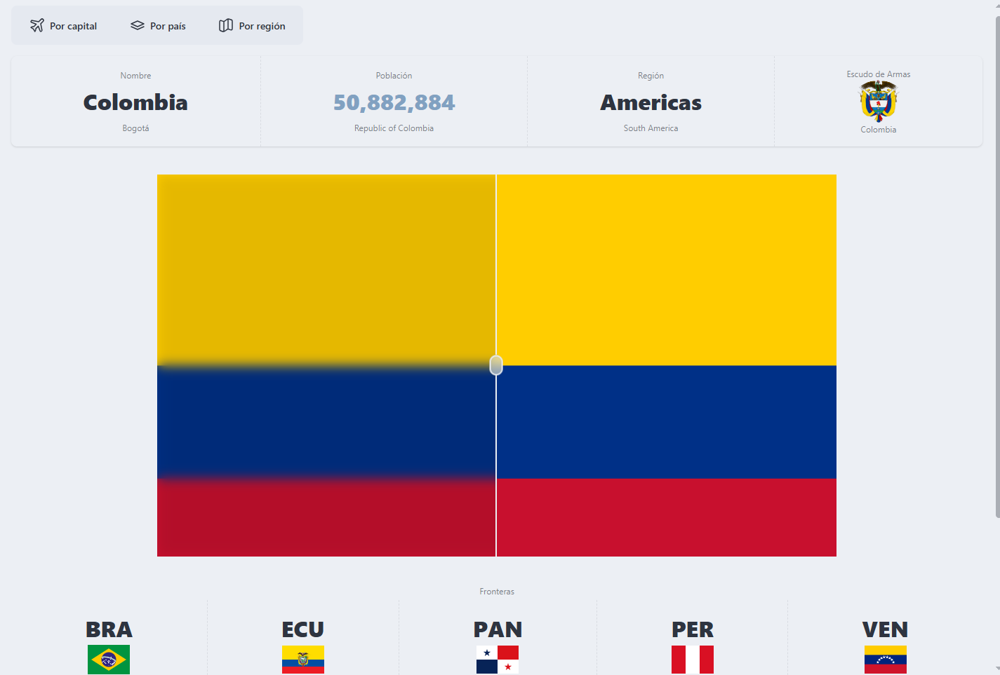

# 🌍 WorldFinder

> Explora países del mundo de forma intuitiva. Busca por capital, ciudad o región y descubre información detallada sobre cualquier nación.



## ✨ Características

- 🔍 **Búsqueda múltiple**: Encuentra países por capital, nombre del país o región
- 📊 **Información detallada**: Población, región, nombre oficial, capital y más
- 🏳️ **Banderas**: Visualización de banderas de países con escudos de armas
- 🌐 **Países fronterizos**: Explora países vecinos de forma interactiva
- 📱 **Responsive**: Diseño adaptativo para dispositivos móviles y escritorio
- ⚡ **Rendimiento**: Búsqueda rápida y eficiente con Angular 19

## 🚀 Demo en Vivo

[Ver Demo](https://tu-usuario.github.io/worldfinder) <!-- Actualiza con tu URL -->

## 🛠️ Tecnologías Utilizadas

- **Frontend**: Angular 19
- **Estilos**: Tailwind CSS + DaisyUI
- **API**: [REST Countries API](https://restcountries.com/)
- **Iconos**: Lucide Icons / Heroicons
- **Tipado**: TypeScript

## 📋 Prerrequisitos

Antes de comenzar, asegúrate de tener instalado:

- [Node.js](https://nodejs.org/) (versión 18 o superior)
- [npm](https://www.npmjs.com/) (viene incluido con Node.js)
- [Angular CLI](https://angular.io/cli) (versión 19)

```bash
npm install -g @angular/cli@19
```

## ⚙️ Instalación

1. **Clona el repositorio**
   ```bash
   git clone [https://github.com/baenat/worldfinder](https://github.com/baenat/country-world-finder).git
   cd country-world-finder
   ```

2. **Instala las dependencias**
   ```bash
   npm install
   ```

3. **Ejecuta la aplicación**
   ```bash
   ng serve
   ```

4. **Abre tu navegador**
   
   Navega a `http://localhost:4200/`

## 🎯 Uso

### Búsqueda de Países

1. **Por Capital**: Haz clic en "Por capital" e ingresa el nombre de una capital
2. **Por País**: Selecciona "Por país" y busca el nombre del país
3. **Por Región**: Usa "Por región" para explorar países de un continente específico

### Navegación

- Haz clic en cualquier país para ver información detallada
- Explora países fronterizos usando las banderas en la sección "Fronteras"
- Usa los filtros para refinar tu búsqueda

## 📁 Estructura del Proyecto

```
worldfinder/
├── src/
│   ├── app/
│   │   ├── country/
│   │   │   ├── components/
│   │   │   ├── interfcaces/
│   │   │   ├── layout/
│   │   │   ├── mappers/
│   │   │   ├── pages/
│   │   │   ├── services/
│   │   │   └── country.routes.ts
│   │   └── shared/
│   │       ├── components/
│   │       ├── pages/
│   │       └── services/
│   ├── assets/
│   └── styles/
├── .postcssrc.json
├── package.json
├── angular.json
├── tsconfig.json
└── README.md
```

## 🔧 Scripts Disponibles

```bash
# Desarrollo
npm start              # Inicia el servidor de desarrollo
ng serve              # Alternativa para desarrollo

# Construcción
npm run build         # Construye la app para producción
ng build             # Construye con Angular CLI

```

## 🎨 Personalización

### Tailwind CSS + DaisyUI

Este proyecto utiliza Tailwind CSS con DaisyUI para un diseño moderno y componentes predefinidos.

```javascript
// .postcssrc.json
{
  "plugins": {
    "@tailwindcss/postcss": {}
  }
}
```
```

// .styles.css
@import "tailwindcss";
@plugin "daisyui" {
  themes: light --default, dark --prefersdark, nord;
}


```

### Temas

Para cambiar el tema, modifica el atributo `data-theme` en el HTML:

```html
<html data-theme="light">
<!-- o -->
<html data-theme="dark">
```

## 📊 API Reference

Este proyecto consume la [REST Countries API v3.1](https://restcountries.com/):

- **Todos los países**: `GET https://restcountries.com/v3.1/all`
- **Por nombre**: `GET https://restcountries.com/v3.1/name/{name}`
- **Por capital**: `GET https://restcountries.com/v3.1/capital/{capital}`
- **Por región**: `GET https://restcountries.com/v3.1/region/{region}`

## 🤝 Contribuir

Las contribuciones son siempre bienvenidas. Para contribuir:

1. Fork el proyecto
2. Crea tu rama de feature (`git checkout -b feature/AmazingFeature`)
3. Commit tus cambios (`git commit -m 'Add some AmazingFeature'`)
4. Push a la rama (`git push origin feature/AmazingFeature`)
5. Abre un Pull Request

## 📝 Roadmap

- [ ] Modo oscuro/claro
- [ ] Favoritos y países guardados
- [ ] Comparación entre países
- [ ] Integración con mapas interactivos
- [ ] Información económica adicional
- [ ] PWA (Progressive Web App)
- [ ] Múltiples idiomas


## 📄 Licencia

Este proyecto está bajo la licencia MIT. Ver el archivo [LICENSE](LICENSE) para más detalles.

## 👨‍💻 Autor

**Tu Nombre**
- GitHub: [@baenat](https://github.com/baenat)
- LinkedIn: [Tu Perfil](https://linkedin.com/in/julian-baena)
